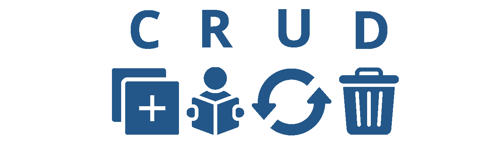

<h1 align="center"> API RESTful Crud </h1>

<p align="center">
    
</p>


Projeto API RESTful Crud (Create, Read, Update, Delete)

## Descrição

O projeto é uma API RESTful aonde  é  possível cadastrar, alterar, ler e excluir usuarios. Interface de Programação de Aplicações (português) cuja sigla API provém do Inglês Application Programming Interface, é um conjunto de rotinas e padrões estabelecidos por um software para a utilização das suas funcionalidades. 

API conta com 5 funcionalidades básicas: obter todos os registros, selecionar um unico registro, cadastrar registro, atualizar o registro e deletar o registro. Até o momento não foi implementado um sistema de autenticação para utilizar a API, possibilitando assim a utilização pública da mesma. 

Para isso foi utilizando o PHP para realizar execução de instruções SQL no banco de dados phpMyAdmin, além disso foi utilizado POO (Programação Orientada a Objetos) e PDO (PHP Data Object) na construção das class. Na arquitetura do projeto foi usado o Composer para fazer autoload das class e o htaccess que  permite usar as URLs amigaveis. Na pasta DOC você encontra todo o planejamento do projeto como o desenho da modelagem do banco de dados  e o próprio banco de dados exportado. 
 
## Rotas:

É a mesma rota para todos o que diferencia é o método, para GET e DELETE é utilizado o id_usuario do registro como parâmetro. Alem disso o unico serviço disponivel até o momento é "usuarios".

### POST
Cadastra os dados no banco de dados

```bash 
https://seudominio.com/api_crud/usuarios/
```

### GET
Traz todos os registros

```bash  
https://seudominio.com/api_crud/usuarios/
```

### GET
Traz um registo específico (o caso em questão, vai trazer os dados referente ao id_usuarios 2)

```bash  
https://seudominio.com/api_crud/usuarios/2
```

### PUT
Atualiza os dados no banco de dados. **Aviso:** na atualização do registro é obrigatorio o envio de todos os dados (id_usuarios, nome, idade, sexo, email, senha) mesmo aqueles que não sofrerão alteraçãoes. 

```bash  
https://seudominio.com/api_crud/usuarios/
```

### DELETE
Excluir o registro baseado no id_usuarios (o caso em questão, vai excluir os dados referente ao id_usuarios 2)

```bash  
https://seudominio.com/api_crud/usuarios/2
```


## Instalação Local

Para executar esse projeto você precisara do  [Composer](https://getcomposer.org/).

Por meio dele sera baixado todas as depedencias do projeto, depois de instalado execute os comandos abaixo na linha do terminal.

1) Para baixa todas as dependencias do projeto

```bash  
composer update 
```

2) Efetuar o carregamento automatico das class

```bash  
composer dump-autoload 
```

3) Edite as configurações padrão do arquivo config.php

```bash  
define("HOST","localhost"); 
```

```bash  
define("BANCO","crud-container"); 
```

```bash  
define("USUARIO","root"); 
```

```bash  
define("SENHA",""); 
```

```bash  
define("BASEURL", "http://localhost/api_crud/"); 
```


## Status do Projeto

**Concluido**: O projeto esta terminado, não havera futuras alterações de funcionalidade.


## Construído com

* [HTML](https://www.w3schools.com/html/) - HTML abreviação para a expressão inglesa HyperText Markup Language, que significa: "Linguagem de Marcação de Hipertexto" é uma linguagem de marcação utilizada na construção de páginas na Web. Documentos HTML podem ser interpretados por navegadores. A tecnologia é fruto da junção entre os padrões HyTime e SGML.

* [CSS](https://www.w3schools.com/css/default.asp) - Cascading Style Sheets é um mecanismo para adicionar estilo a um documento web. O código CSS pode ser aplicado diretamente nas tags ou ficar contido dentro das tags "style". Também é possível, em vez de colocar a formatação dentro do documento, criar um link para um arquivo CSS que contém os estilos.

* [JavaScript](https://developer.mozilla.org/pt-BR/docs/Web/JavaScript) - CJavaScript é uma linguagem de programação interpretada estruturada, de script em alto nível com tipagem dinâmica fraca e multiparadigma. Juntamente com HTML e CSS, o JavaScript é uma das três principais tecnologias da World Wide Web.

* [PHP](https://www.php.net/manual/pt_BR/intro-whatis.php) - PHP é uma linguagem interpretada livre, usada originalmente apenas para o desenvolvimento de aplicações presentes e atuantes no lado do servidor, capazes de gerar conteúdo dinâmico na World Wide Web.

* [SQL](https://www.w3schools.com/sql/) - Structured Query Language, ou Linguagem de Consulta Estruturada ou SQL, é a linguagem de pesquisa declarativa padrão para banco de dados relacional. Muitas das características originais do SQL foram inspiradas na álgebra relacional.

* [Composer](https://getcomposer.org/) - O Composer é um gerenciador de pacotes no nível do aplicativo para a linguagem de programação PHP que fornece um formato padrão para gerenciar dependências do software PHP e bibliotecas necessárias. Foi desenvolvido por Nils Adermann e Jordi Boggiano, que continuam a gerenciar o projeto. 

## Versão das Linguagens e Ferramentas

#### Servidor de base de dados

* MariaDB - 10.4.21-MariaDB

#### Servidor web

* PHP - 7.3.31
* Apache - 2.4.51

#### Gerenciamento do banco de dados

* phpMyAdmin - 5.1.1

#### Ferramentas

* Xampp - 3.3.0


## Autor

* **Cesar dos Santos de Almeida** - *responsável pela construção e desenvolvimento do projeto*

## Licença

Este projeto está licenciado sob a licença MIT - consulte o arquivo  [LICENSE.md](LICENSE.md) para obter detalhes


## Links

* [Demo do projeto](http://csantosalmeida.rf.gd/api_crud/usuarios/) - Link da Demo
* [Documentação](https://cesar959.github.io/api-crud/) - Link da Documentação


